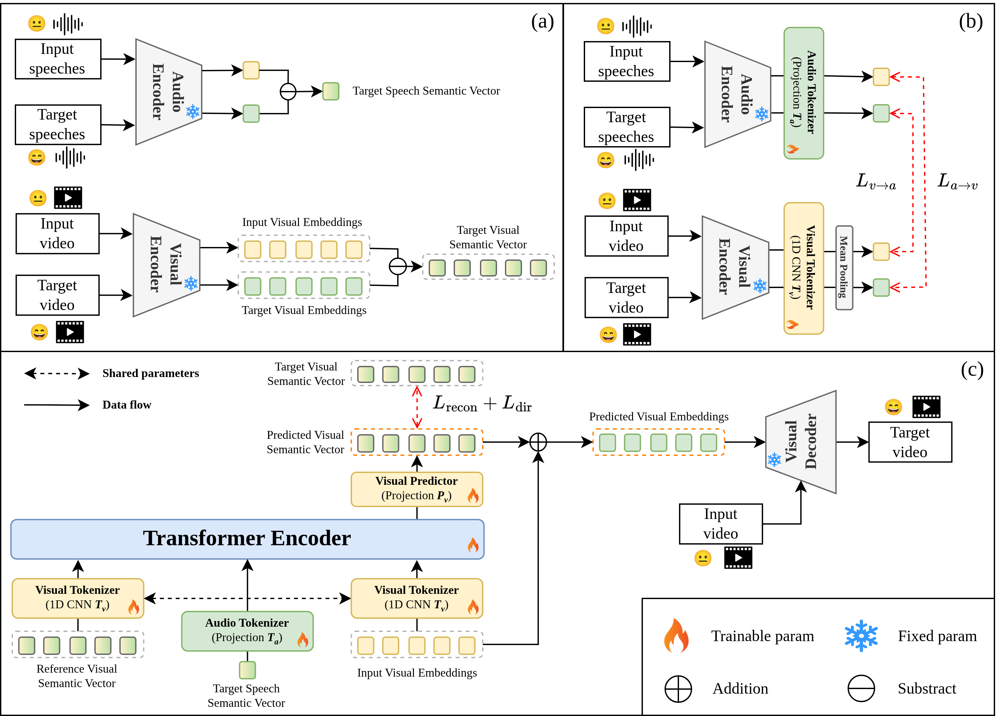

<!-- # EDTalk -->

### <div align="center"> 😄 Cross-Modal Emotion Transfer for Emotion Editing in Talking Face Video</div> 


<p align="center">
  <a href="https://scholar.google.com/citations?user=0M03qmEAAAAJ&hl=en">Chanhyuk Choi</a>,
  <a href="">Taesoo Kim</a>, 
  <a href="">Donggyu Lee</a>, 
  <a href="">Siyeol Jung</a>, 
  <a href="https://scholar.google.com/citations?user=5dGWexcAAAAJ&hl=en&oi=sra">Taehwan Kim</a>
  <br><br>
  Ulsan National Institute of Science and Technology<br>
  <br>
<i><strong><a href='https://cvpr.thecvf.com/' target='_blank'>CVPR 2026</a></strong></i>
</p>

<div align="center">
  <a href="https://chanhyeok-choi.github.io/C-MET/"></a> &ensp;
  <a href="https://arxiv.org/abs/2604.07786"></a> &ensp;
  <a href="https://github.com/chanhyeok-choi/C-MET"></a> &ensp;
  <a href="https://huggingface.co/coldhyuk/C-MET"></a> &ensp;
  <a href="https://huggingface.co/spaces/coldhyuk/C-MET"></a> &ensp;
</div>

</div>

<div align="center">
  </img>
  <br>
</div>
<br>


## 🎏 Abstract
Talking face generation has gained significant attention as a core application of generative models. To enhance the expressiveness and realism of synthesized videos, emotion editing in talking face video plays a crucial role. However, existing approaches often limit expressive flexibility and struggle to generate extended emotions. Label-based methods represent emotions with discrete categories, which fail to capture a wide range of emotions.
Audio-based methods can leverage emotionally rich speech signals—and even benefit from expressive text-to-speech (TTS) synthesis—but they fail to express the target emotions because emotions and linguistic contents are entangled in emotional speeches. Images-based methods, on the other hand, rely on target reference images to guide emotion transfer, yet they require high-quality frontal views and face challenges in acquiring reference data for extended emotions (e.g., sarcasm). To address these challenges, we propose <strong>Cross-Modal Emotion Transfer (C-MET)</strong>, a novel approach that generates facial expressions based on speeches by modeling emotion semantic vectors between speech and visual feature spaces. C-MET leverages a large-scale pretrained audio encoder and a disentangled facial expression encoder to learn emotion semantic vectors that represent the difference between two different emotional embeddings across modalities.Extensive experiments on the MEAD and CREMA-D datasets demonstrate that our method improves emotion accuracy by 14\% over state-of-the-art methods, while generating expressive talking face videos—even for unseen extended emotions.
## 💻 Overview
<div align="center">
  </img>
  <br>
</div>
<br>


## 🔥 Update

- [2026/04/14] Hugging Face [Model](https://huggingface.co/coldhyuk/C-MET) and [Space](https://huggingface.co/spaces/coldhyuk/C-MET) are available.
- [2026/04/09] [arXiv](https://arxiv.org/abs/2604.07786) is available.
- [2026/03/07] Data processing and train code are available.
- [2026/03/06] Pretrained weights and inference code are available.
- [2026/02/20] C-MET has been accepted for CVPR 2026!

## 📅 TODO

- [x] **Release Hugging Face Model and Space.**
- [x] **Release Arxiv paper.**
- [x] **Release training code.**
- [x] **Release inference code.**
- [x] **Release pre-trained models.**


## 🎮 Installation
We train and test based on Python 3.8 and Pytorch. To install the dependencies run:
```bash
git clone https://github.com/ChanHyeok-Choi/C-MET
cd C-MET
```

### Install dependency
```
conda create -n C_MET python=3.8
conda activate C_MET
```

- python packages
```
pip install -r requirements.txt
```


## 🎬 Quick Start

Download the [checkpoints](https://drive.google.com/file/d/1cTB3GqCDIigtedh-SNzUzYIyW0pBk_mQ/view?usp=sharing) and put it into ./checkpoints. In addition, download [EDTalk Audio2Lip.pt and EDTalk.pt](https://drive.google.com/file/d/1EKJXpq5gwFaRfkiAs6YUZ6YEiQ-8X3H3/view) from [EDTalk](https://github.com/tanshuai0219/EDTalk) and put them into ./pretrained_weights


### **C-MET**: Run the demo:
#### For user-friendliness, we extracted emotion2vec+large features of eight common sentiments (***angry, contempt, disgusted, fear, happy, neutral, sad, surprised***) and six extended emotions (***charismatic, desirous, empathetic, envious, romantic, sarcastic***). Please check subfolders in the `audios` one can directly specify the sentiment to generate emotional talking face videos (recommended)
  ```
  python inference.py --num_samples recommend_more_than_three --connector_exp_path path/to/model --source_path path/to/image --audio_driving_path path/to/audio --pose_driving_path path/to/pose --save_path path/to/save --neu_e2v_path path/to/neutral_emotion2vec+large_features --emo_e2v_path path/to/emotional_emotion2vec+large_features

  # example:
  python inference.py --num_samples 10 \
    --connector_exp_path ./checkpoints/_epoch_2105_checkpoint_step000200000.pth\
    --source_path ./asset/identity/ChatGPT_man3_crop.png \
    --audio_driving_path ./asset/audio/W009_038.wav \
    --pose_driving_path ./asset/video/W009_038.mp4 \
    --save_path ./res/ChatGPT_man3_happy.mp4 \
    --neu_e2v_path ./audios/MEAD/neutral/emotion2vec+large_features/ \
    --emo_e2v_path ./audios/MEAD/happy/emotion2vec+large_features/
  ```
  ****


  The result will be stored in save_path.

  **Source_path and videos used must be first cropped using scripts [crop_image2.py](data_preprocess/crop_image2.py) (download [shape_predictor_68_face_landmarks.dat](https://github.com/italojs/facial-landmarks-recognition/blob/master/shape_predictor_68_face_landmarks.dat) and put it in ./data_preprocess dir) and [crop_video.py](data_preprocess/crop_video.py). Make sure the every video' frame rate must be 25 fps**

  You can also use [crop_image.py](data_preprocess/crop_image.py) to crop the image.


## Face Super-resolution (Optional)

The purpose is to upscale the resolution from 256 to 512 and address the issue of blurry rendering.

Please install addtional environment here:

```
pip install facexlib
pip install tb-nightly -i https://mirrors.aliyun.com/pypi/simple
pip install gfpgan
```

Then enable the option `--sr` in your scripts. The first time will download the weights of gfpgan (you can optionally first download [gfpgan ckpts](https://drive.google.com/file/d/1SEWp_lnvxTHI1EIzurbNGYbPABmxih8A/view?usp=sharing) and put them in gfpgan/weights dir).


Here are some examples:

  ```
  python inference.py --num_samples recommend_more_than_three --connector_exp_path path/to/model --source_path path/to/image --audio_driving_path path/to/audio --pose_driving_path path/to/pose --save_path path/to/save --neu_e2v_path path/to/neutral_emotion2vec+large_features --emo_e2v_path path/to/emotional_emotion2vec+large_features --sr

  python inference.py --num_samples 10 \
    --connector_exp_path ./checkpoints/_epoch_2105_checkpoint_step000200000.pth\
    --source_path ./asset/identity/ang_crop.png \
    --audio_driving_path ./asset/audio/W009_038.wav \
    --pose_driving_path ./asset/video/W009_038.mp4 \
    --save_path ./res/ang_angry.mp4 \
    --neu_e2v_path ./audios/MEAD/neutral/emotion2vec+large_features/ \
    --emo_e2v_path ./audios/MEAD/angry/emotion2vec+large_features/ \
    --sr
  ```

  | | | | |
  |---|---|---|---|
  | <video controls loop muted width="220" src="https://github.com/user-attachments/assets/65cf3d1a-5256-4399-9c84-49873c8ad9e6"></video> | <video controls loop muted width="220" src="https://github.com/user-attachments/assets/d91688d2-b5aa-4104-8f3e-69f1a9691ef6"></video> | <video controls loop muted width="220" src="https://github.com/user-attachments/assets/0ec3d1ea-e4ec-410f-a3eb-9d88bd320a74"></video> | <video controls loop muted width="220" src="https://github.com/user-attachments/assets/044fd0a5-8cd7-4f48-bd96-9d5c7e2371e5"></video> |
  | <video controls loop muted width="220" src="https://github.com/user-attachments/assets/04b0f945-0245-40b9-aa45-46d39684d54a"></video> | <video controls loop muted width="220" src="https://github.com/user-attachments/assets/3bc41be9-f8f0-4e69-aabe-19cadc096e2e"></video> | <video controls loop muted width="220" src="https://github.com/user-attachments/assets/c97af3b2-da30-462e-a92b-c4ec9436972a"></video> | <video controls loop muted width="220" src="https://github.com/user-attachments/assets/46d2efc8-384b-40a2-9dba-fb2ddeb1935c"></video> |


  | | | | |
  |---|---|---|---|
  | <video controls loop muted width="220" src="https://github.com/user-attachments/assets/48706b60-d9e4-479d-a38e-f5c42583b3e6"></video> | <video controls loop muted width="220" src="https://github.com/user-attachments/assets/b6fb3771-eaf8-4b39-a2a3-1c9130228fb5"></video> | <video controls loop muted width="220" src="https://github.com/user-attachments/assets/7f26e1ec-f796-4a54-8e0c-d6d7653beef5"></video> | <video controls loop muted width="220" src="https://github.com/user-attachments/assets/aa0ffbf6-f3f2-4325-999f-204f2a0a77b6"></video> |
  | <video controls loop muted width="220" src="https://github.com/user-attachments/assets/b819d939-641c-4051-b820-3c6fcb788169"></video> | <video controls loop muted width="220" src="https://github.com/user-attachments/assets/3081f756-2f60-44e3-8233-cba23bf59dbb"></video> | <video controls loop muted width="220" src="https://github.com/user-attachments/assets/c693adc3-92ca-4789-8ea4-4f6055c83502"></video> | |


##  🎬 Data Preprocess for Training
<details> <summary> Data Preprocess for Training </summary>

**Note**: Please follow the [EDTalk preprocess](https://github.com/tanshuai0219/EDTalk?tab=readme-ov-file#-data-preprocess-for-training). After preprocessing, please run `python prep_video.py --root ./dataset/MEAD/FPS25` to extract EDTalk facial expression features.

- Download the MEAD and CREMA-D dataset:

  1) **MEAD**. [download link](https://wywu.github.io/projects/MEAD/MEAD.html). 

      We only use *Front* videos saying *Common* and *Generic* sentences over all emotions. We extract audios and orgnize the data as follows:

    ```text
    ./dataset/MEAD/FPS25/
    ├── M003                            # ID
    │   └── front                       # view
    │       ├── angry                   # emotion
    │       │   ├── level_1             # intensity
    │       │   │   ├── 001.mp4         # video
    │       │   │   ├── 001.wav         # audio
    │       │   │   ├── 001_ED_exp.npy  # facial expression feature
    │       │   │   ├── 001_ED_pose.npy # pose motion feature
    │       │   │   ├── 001_ED_lip.npy  # lip motion feature
    |       |   |   |-- 002.mp4
    |       |   |   |-- ...
    ```

  2) **CREMA-D**. [download link](https://github.com/CheyneyComputerScience/CREMA-D).

      We follow the same preprocessing for all data in CREMA-D datasets.

- To extract emotion2vec+large features, run the below:

  ```
  python extract_e2v+L.py --root path/to/audios

  # example for train:
  python extract_e2v+L.py --root ./dataset/MEAD/FPS25
  # example for inference:
  python extract_e2v+L.py --root ./audios/gemini/sarcastic
  ```

  If extracted well, you will have the followings:

    ```text
    ./dataset/MEAD/FPS25/
    ├── M003                            
    │   └── front                       
    │       ├── angry                   
    │       │   ├── level_1             
    │       │   │   ├── emotion2vec+large_features
    │       │   │   │   ├── 001.npy              
    │       │   │   │   ├── 002.npy              
    |       |   |   |   |-- ...

    ./audios/gemini/sarcastic
    |-- emotion2vec+large_features
    |   |-- sarcastic_0.wav
    |   |-- sarcastic_1.npy
    |   |-- ...
    ```


</details>

## 🎬 Start Training
<details> <summary> Start Training </summary>

- Pretrain C-MET: Once the dataset is ready, you can readily train C-MET as follows:

  ```
  python train.py
  ```

  Once started training, you can track the training log as the below command:

  ```
  tensorboard --logdir ./tensorboard_runs
  ```

</details>


## 🎓 Citation

```
@inproceedings{choi2026cross,
  title={Cross-Modal Emotion Transfer for Emotion Editing in Talking Face Video},
  author={Choi, Chanhyuk and Kim, Taesoo and Lee, Donggyu and Jung, Siyeol and Kim, Taehwan},
  booktitle={IEEE/CVF Conference on Computer Vision and Pattern Recognition (CVPR)},
  year={2026}
}
```

## 🙏 Acknowledgement
Some code are borrowed from following projects:
* [emotion2vec](https://github.com/ddlBoJack/emotion2vec)
* [PD-FGC](https://github.com/Dorniwang/PD-FGC-inference)
* [FOMM video preprocessing](https://github.com/AliaksandrSiarohin/video-preprocessing)
* [IP-LAP](https://github.com/Weizhi-Zhong/IP_LAP)
* [EDTalk](https://github.com/tanshuai0219/EDTalk)
* [EmoKnob](https://github.com/tonychenxyz/emoknob)
